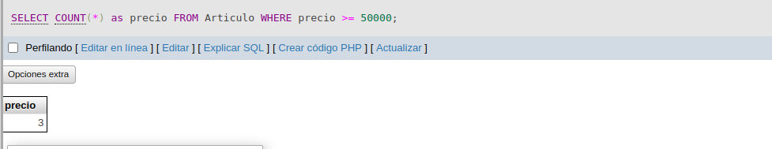

# Ejercicio_SQL_3

### Realice las siguientes consultas sobre la BD Zapateria, incluyendo los respectivos pantallazos de phpMyAdmin de cada una.

1. Obtener los nombres de los productos de la Zapateria
2. Obtener los nombres y los precios de los productos de la Zapatería.
3. Obtener el nombre de los productos cuyo precio sea menor o igual a 50000
4. Obtener todos los datos de los artículos cuyo precio esté entre 5000 y 40000 (ambas canditades incluidas)
5. Obtener el nombre y el precio de cada artículo, en dolares.
6. Obtener el precio promedio de todos los artículos
7. Obtener el precio medio de los artículos cuyo codigo de fabricante sea 2
8. Obtener el número de artículos cuyo precio sea mayor o igual a 50000
9. Obtener el nombre y precio de los artículos cuyo precio sea mayor o igual a 50000 y ordenarlos descendentemente por precio, y luego ascendentemente por nombre.
10. Obtener un listado completo de artículos, incluyendo por cada articulo los datos del artículo y de su fabricante.
11. Obtener un listado de articulos, incluyendo el nombre del articulo, su precio y el nombre de su fabricante.
12. Obtener el precio medio de los productos  de cada frabricante, mostrando solo los codigos de fabricante.
13. Obtener el precio medio de los productos de cada fabricante, mostrando el nombre del fabricante.
14. Obtener el nombre de los fabricantes que ofrezcan productos cuyo precio medio sea mayor o igual a 50000
15. Obtener el nombre y el precio del artículo mas barato.

### 1. PRODUCTOS DE LA ZAPATERIA

### 2. PRECIOS DE LA ZAPATERIA

### 3. PRECIO MENOR O IGUAL A 50000

### 4. precio esté entre 5000 y 40000 (ambas canditades incluidas)

### 5. artículo en dolares.

### 6. promedio de todos los artículos

### 7. codigo de fabricante sea 2

### 8. MAYOR A 50000

### 9. ORDEN DESENDIENTE

### 10. LISTADO DE ARTICULOS

### 11. LISTADO DEL ARTICULO PRECIO Y NOMBRE

### 12. Codigos de fabricante

### 13. nombre del fabricante

### 14. precio medio sea mayor o igual a 50000

### 15. nombre y el precio del artículo mas barato
